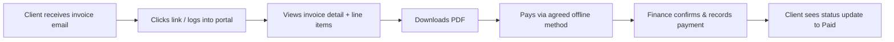
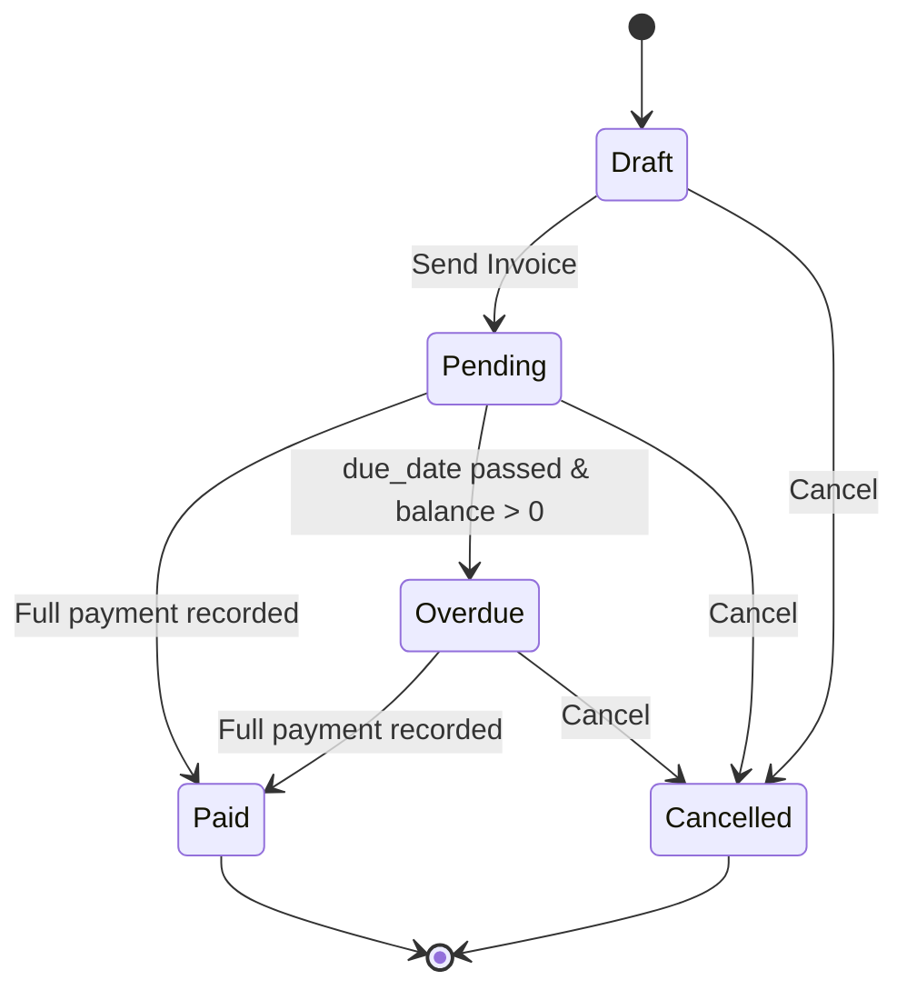
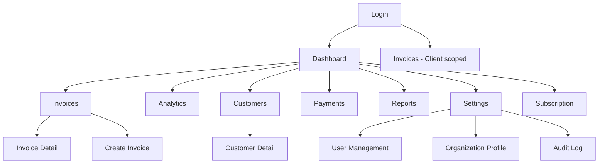
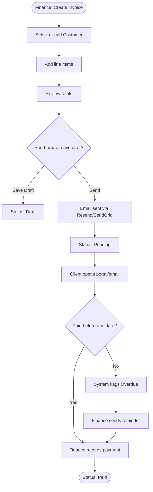
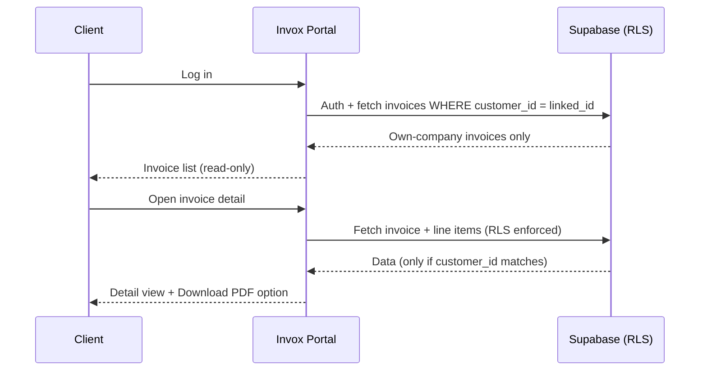
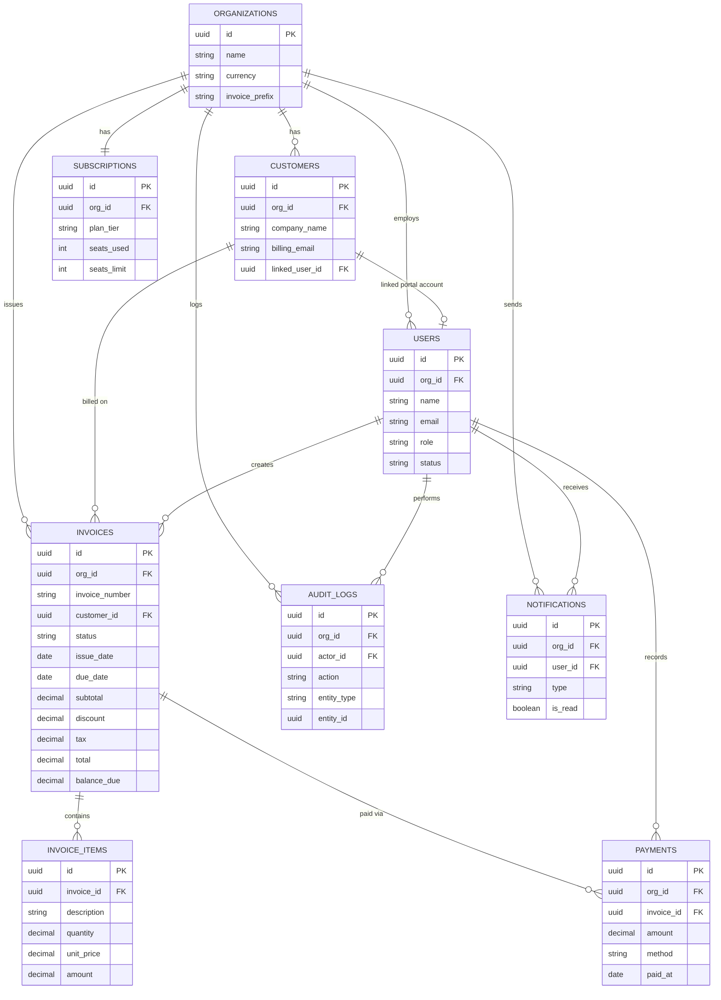
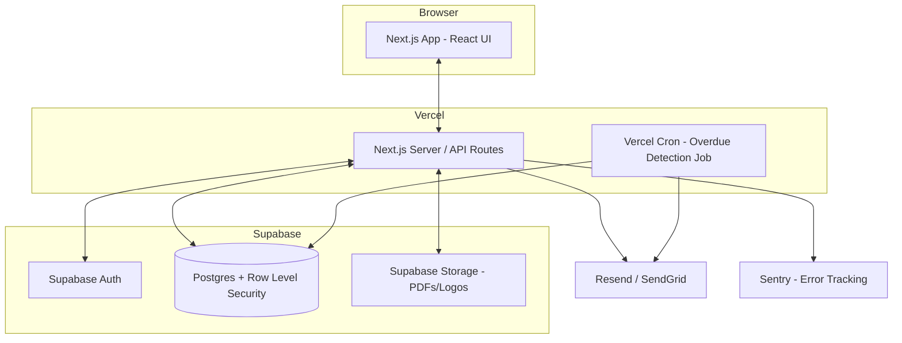

# Invox — Invoice Management Dashboard
## Product Requirements Document (PRD)

**Version:** 1.0 (MVP)
**Status:** Draft for engineering handoff
**Document owner:** Product
**Prepared for:** Design, Frontend, Backend, QA, and AI coding agents (Claude Code, Cursor, Windsurf, GitHub Copilot)

---

## Table of Contents

1. Executive Summary
2. Business Context
3. Problem Statement
4. Vision
5. Goals & KPIs
6. Scope
7. Personas
8. User Journey
9. Feature List
10. Functional Requirements
11. Non-Functional Requirements
12. Business Rules
13. Validation Rules
14. UX Requirements
15. UI Requirements
16. Information Architecture
17. Sitemap
18. User Flow
19. Wireframe Notes
20. Data Model
21. ERD
22. API Contract
23. Architecture
24. Security
25. Logging
26. Monitoring
27. QA Strategy
28. Acceptance Criteria
29. Risks
30. Roadmap
31. Appendix

---

## 1. Executive Summary

Invox is an internal, Apple-inspired invoice management dashboard that gives a single organization one workspace to create, send, track, and collect on client invoices. It replaces manual, spreadsheet-driven invoicing with a structured system that gives Finance staff a fast invoice-to-cash workflow, gives the Admin/Owner real-time visibility into outstanding revenue and collection speed, and gives Clients a self-service portal to check their own invoice status without emailing back and forth.

The MVP is built on Next.js (frontend + API routes), Supabase (Postgres, Auth, Storage), and Vercel (hosting), with transactional email via Resend/SendGrid. The product is scoped as a single-organization internal tool — not a multi-tenant SaaS — with three roles: **Admin/Owner**, **Staff Finance**, and **Client** (read-only portal access to their own invoices).

The visual language follows Apple's Human Interface Guidelines: soft neutral colors, frosted-glass navigation, generous whitespace, rounded 20–28px cards, an 8pt spacing system, and smooth, understated micro-interactions — applied to a functionally complete invoice management product comparable in polish to Stripe Dashboard, Linear, and Notion.

## 2. Business Context

The organization currently manages client invoicing manually — spreadsheets, email threads, and ad-hoc PDF generation — with no single system of record for invoice status. **(Assumption: reasoned from the stated goal of "menggantikan cara manual" confirmed during discovery; the specific current tool, if any, was not disclosed and is not required for MVP scope.)**

Finance staff spend time manually cross-checking which invoices are paid, pending, or overdue, and the Admin/Owner has no real-time view of outstanding revenue or average collection time without asking Finance directly. Clients have no way to self-check an invoice's status and frequently email to ask "did you receive my payment" or "can you resend the invoice," creating avoidable back-and-forth.

Invox is being built as an internal MVP for this organization first, with the data model and RBAC structured cleanly enough that a future multi-tenant SaaS version (Phase 2+, out of scope here) would not require a rewrite.

## 3. Problem Statement

- **No single source of truth.** Invoice status lives across spreadsheets and inboxes; nobody can answer "what's outstanding right now" without manually compiling.
- **No cash-flow visibility for leadership.** The Admin/Owner cannot see outstanding revenue, invoices paid this month, or average days-to-payment without asking Finance to compile it.
- **Slow, error-prone invoice creation.** Manually building invoices (line items, tax, totals) in spreadsheets or documents is slow and introduces calculation errors.
- **No self-service for clients.** Clients cannot check invoice status themselves, generating repetitive "status check" emails to Finance.
- **No accountability trail.** There is no record of who changed an invoice, who marked it paid, or when — making disputes and internal audits difficult.

## 4. Vision

Invox becomes the single, trusted workspace where Finance runs the entire invoice-to-cash cycle — creation, sending, tracking, collection, and reconciliation — inside one Apple-grade interface that feels effortless to use daily, while giving the Admin/Owner an always-current view of the business's cash position and giving every client a transparent, self-service view of what they owe.

## 5. Goals & KPIs

| Goal | Description |
|---|---|
| G1 | Centralize 100% of invoice lifecycle management (create → send → track → collect) inside Invox |
| G2 | Reduce average time-to-payment |
| G3 | Give the Admin/Owner real-time outstanding-revenue and cash-flow visibility |
| G4 | Reduce manual effort and errors in invoice creation |
| G5 | Give every client self-service visibility into their own invoices, reducing status-check email volume |
| G6 | Establish a complete, immutable audit trail for all financial actions |

**KPIs / success metrics** *(Assumption: no numeric targets were provided during discovery; the following are reasoned defaults derived from the stated goals and the KPI cards already specified in the design brief — e.g. "Average time to get paid: 16 days" — and should be replaced with real baselines once Invox has a month of production data.)*

| Metric | Target |
|---|---|
| % of company invoices issued through Invox | 100% within 60 days of launch |
| Average days to get paid | ≤ 16 days |
| % invoices sent electronically (vs. manual) | ≥ 90% |
| Invoice data-entry error rate | ≤ 2% |
| Financial actions covered by audit trail | 100% |
| Client-portal adoption (clients who log in at least once) | ≥ 70% of active clients within 90 days |

## 6. Scope

### In scope (MVP)
- Authentication (email/password + Google OAuth), role-based access (Admin/Owner, Staff Finance, Client)
- Dashboard with KPI cards and analytics (revenue chart, invoice volume, payment success rate, activity feed)
- Invoice management: create, edit, list, filter, search, detail view, line items, status lifecycle
- Sending invoices and payment reminders via email (Resend/SendGrid)
- Payment recording and tracking (manual entry — no live payment gateway)
- Customer (client company) management
- Reports & export (CSV, PDF)
- Client portal (read-only invoice access for the Client role)
- Notifications (in-app)
- Organization settings, user & role management
- Subscription page (Invox's own plan/billing for the organization)
- Audit log for all financial actions
- Responsive layout: desktop (1440px primary), tablet, mobile

### Out of scope (Phase 2+ candidates)
- Estimates/Quotes module
- Recurring invoice automation
- Hosted checkout / live payment gateway (Stripe, Midtrans, etc.) for collecting payment directly
- Multi-tenant SaaS (multiple organizations on one deployment)
- Multi-currency conversion / FX rates (MVP supports one configured currency per organization)
- Multi-language UI (MVP ships English-only UI copy)
- Native mobile app (mobile is supported via responsive web only)
- Third-party accounting integrations (QuickBooks, Xero, etc.)

**(Assumption: the reference screenshot's top navigation shows "Estimates," "Recurring," and "Checkouts" tabs; since these were not present in the explicit sidebar/feature list given in the design brief, they're treated as visual inspiration only and placed in the Phase 2 roadmap rather than MVP scope.)**


---

## 7. Personas

### Persona 1 — Admin/Owner
- **Role in system:** Admin/Owner
- **Who they are:** Runs the business or leads Finance; ultimate decision-maker on the organization's Invox account.
- **Goals:** Real-time cash-flow visibility, control over users/roles, oversight of every invoice and customer, manage the Invox subscription.
- **Frustrations today:** Has to ask Finance for status updates; no dashboard exists today.
- **Access:** Full access to every module, including Settings, User Management, Subscription, and Audit Log.

### Persona 2 — Staff Finance
- **Role in system:** Staff Finance
- **Who they are:** Accounts-receivable / finance associate who runs day-to-day invoicing.
- **Goals:** Create and send invoices quickly, know exactly what's overdue, record payments accurately, minimize manual errors.
- **Frustrations today:** Manual spreadsheet upkeep, chasing overdue clients without reminders, no audit trail for disputes.
- **Access:** Full access to Invoices, Customers, Payments, Analytics, Reports, and Notifications. No access to organization Settings, User Management, or Subscription billing.

### Persona 3 — Client
- **Role in system:** Client (external, portal-only)
- **Who they are:** A contact at a client company that receives invoices from the organization.
- **Goals:** Quickly check what they owe, when it's due, and download a PDF copy for their own records.
- **Frustrations today:** Has to email Finance to ask for invoice status or a resend.
- **Access:** Read-only access to their own company's invoices only. Cannot view other clients' data, cannot edit anything.

## 8. User Journey

**Journey A — Finance creates, sends, and gets paid on an invoice**

```mermaid
flowchart LR
    A[Staff Finance logs in] --> B[Opens Dashboard]
    B --> C[Clicks Create Invoice]
    C --> D[Selects/creates Customer]
    D --> E[Adds line items, tax, discount]
    E --> F[Reviews totals, saves as Draft]
    F --> G{Ready to send?}
    G -- Yes --> H[Sends invoice via email]
    H --> I[Status: Pending]
    I --> J[Client views invoice in portal/email]
    J --> K{Paid on time?}
    K -- Yes --> L[Finance records payment]
    L --> M[Status: Paid]
    K -- No, past due date --> N[System auto-flags Overdue]
    N --> O[Finance sends reminder]
    O --> L
```



**Journey B — Client checks and pays an invoice**



## 9. Feature List

### F1 — Authentication & Session Management
- **Epic:** Account Access
- **User Story:** As a user (Admin/Owner, Staff Finance, or Client), I want to securely log in so that I can access only the data my role permits.
- **Acceptance Criteria:**
  1. Given valid email/password or Google OAuth credentials, when the user submits login, then they are redirected to their role's default landing page (Dashboard for Admin/Finance, Invoice list for Client).
  2. Given an invalid credential, when login is attempted, then a clear inline error is shown without revealing whether the email exists.
  3. Given 5 failed attempts within 10 minutes, when a 6th attempt is made, then the account is temporarily rate-limited.
- **Business Rules:** Only Admin/Owner can create Staff Finance accounts. Client accounts are created by Admin/Owner or Staff Finance when a Customer is added, and activated via an emailed invite link.
- **Validation Rules:** Email must be valid format; password minimum 8 characters, at least 1 number.
- **Error Scenarios:** Expired invite link → user prompted to request a new one. OAuth email mismatch with invited email → block and show explanation.
- **Edge Cases:** User invited as Client but no linked Customer record yet → block login with "account not yet activated" message.

### F2 — Dashboard Overview
- **Epic:** Business Visibility
- **User Story:** As an Admin/Owner or Staff Finance, I want a dashboard with KPI cards and charts so that I can see the business's invoicing health at a glance.
- **Acceptance Criteria:**
  1. Given invoices exist, when the dashboard loads, then it shows Outstanding Revenue, Invoices Paid, Average Payment Time, and Upcoming Payments, each with a month-over-month delta.
  2. Given no data exists yet, when the dashboard loads, then each card shows a friendly empty state instead of $0/blank.
  3. KPI values reflect data no more than 5 minutes stale.
- **Business Rules:** "Outstanding Revenue" = sum of balance_due across invoices with status in (pending, overdue). "Average Payment Time" = mean(paid_at − issue_date) across invoices paid in the last 90 days.
- **Validation Rules:** N/A (read-only view).
- **Error Scenarios:** Analytics query timeout → show cached last-known values with a "last updated" timestamp.
- **Edge Cases:** Organization with zero paid invoices → Average Payment Time shows "—" rather than 0 days.

### F3 — Invoice Management (CRUD, List, Filter, Search)
- **Epic:** Core Invoicing
- **User Story:** As a Staff Finance user, I want to create, edit, list, filter, and search invoices so that I can manage the full invoice catalog efficiently.
- **Acceptance Criteria:**
  1. Given required fields are filled, when Finance saves an invoice, then it is created with status Draft and a unique, sequential invoice number.
  2. Given a list of invoices, when a user filters by customer, status, or date range, then only matching invoices are shown.
  3. Given a search term, when entered, then invoices matching invoice number or customer name are returned within 300ms (p95).
- **Business Rules:** Invoice numbers are organization-scoped, sequential, and immutable once assigned (format: `INV-{YYYY}-{0001}`). Only Draft invoices are fully editable; Sent/Pending/Paid invoices allow status and payment updates only, not line-item edits (to preserve audit integrity).
- **Validation Rules:** At least 1 line item required; due date must be ≥ issue date; amounts must be > 0.
- **Error Scenarios:** Attempt to edit line items on a non-Draft invoice → blocked with explanation; offer "duplicate as new draft" instead.
- **Edge Cases:** Deleting a Draft invoice with no payments recorded is allowed; deleting any invoice with a recorded payment is blocked (must be Cancelled instead).

### F4 — Invoice Detail & Line Items
- **Epic:** Core Invoicing
- **User Story:** As a user, I want a detail panel showing invoice number, customer, line items, tax, discount, subtotal, and balance due so that I understand exactly what's owed.
- **Acceptance Criteria:**
  1. Given an invoice is selected from the list, when the detail panel opens, then it shows all line items, subtotal, discount, tax, total, and balance due, matching the master list totals exactly.
  2. Given a discount or tax rate is changed on a Draft, when saved, then totals recalculate automatically.
- **Business Rules:** `total = subtotal − discount + tax`; `balance_due = total − sum(payments applied)`.
- **Validation Rules:** Discount cannot exceed subtotal; tax rate between 0–100%.
- **Error Scenarios:** Rounding mismatch between line-item sum and subtotal → system recalculates from line items as source of truth.
- **Edge Cases:** Invoice with a single line item and $0 tax/discount still renders all summary rows (no layout collapse).

### F5 — Send Invoice & Payment Reminders (Email)
- **Epic:** Collections
- **User Story:** As a Staff Finance user, I want to send an invoice or reminder by email so that clients are notified without manual copy-paste.
- **Acceptance Criteria:**
  1. Given a Draft invoice, when "Send Invoice" is clicked, then an email (via Resend/SendGrid) is sent to the Customer's billing email, status changes to Pending, and `sent_at` is recorded.
  2. Given a Pending or Overdue invoice, when "Send Reminder" is clicked, then a reminder email is sent and logged in Recent Activity.
  3. Given the email fails to send, when this happens, then the invoice status does not change and the user sees a retry option.
- **Business Rules:** Reminders can be sent manually at any time on Pending/Overdue invoices; system does not auto-send reminders in MVP (Assumption: automated reminder scheduling is a Phase 2 enhancement; MVP is manual-trigger only, matching the "Send Reminder" quick action explicitly requested).
- **Validation Rules:** Customer must have a valid billing email before sending is allowed.
- **Error Scenarios:** Invalid/missing customer email → block send, prompt to update Customer record.
- **Edge Cases:** Sending the same invoice twice does not duplicate line items or totals, only re-triggers delivery.

### F6 — Payment Recording & Tracking
- **Epic:** Collections
- **User Story:** As a Staff Finance user, I want to record a payment against an invoice so that balances and statuses stay accurate.
- **Acceptance Criteria:**
  1. Given a Pending or Overdue invoice, when a payment is recorded for the full balance, then the invoice status changes to Paid and `paid_at` is set.
  2. Given a partial payment is recorded, then balance_due decreases accordingly and status remains Pending (or Overdue, if past due date).
  3. Every payment recorded creates an immutable entry visible in the invoice's payment history.
- **Business Rules:** Payments are manually recorded (no live gateway in MVP); payment method is a free-text/select field (e.g. Bank Transfer, Cash, Check) for record-keeping only.
- **Validation Rules:** Payment amount must be > 0 and ≤ current balance_due.
- **Error Scenarios:** Attempt to record payment exceeding balance_due → blocked with inline error.
- **Edge Cases:** Recording a payment on a Cancelled invoice is blocked.

### F7 — Overdue Detection
- **Epic:** Collections
- **User Story:** As the system, I want to automatically flag invoices as Overdue so that Finance doesn't have to track due dates manually.
- **Acceptance Criteria:**
  1. Given a Pending invoice whose due_date has passed with balance_due > 0, when a daily scheduled job runs, then its status is automatically updated to Overdue.
  2. Given an invoice moves to Overdue, then it appears in the "Overdue" KPI/filter and triggers an in-app notification to Staff Finance and Admin/Owner.
- **Business Rules:** Overdue check runs once daily via a scheduled job (Vercel Cron → Supabase function).
- **Validation Rules:** N/A (system-triggered).
- **Error Scenarios:** Scheduled job failure → alert sent to monitoring channel; next run reconciles any missed transitions.
- **Edge Cases:** Invoice paid in full on the exact due date is not marked Overdue.

### F8 — Customer Management
- **Epic:** Relationship Management
- **User Story:** As a Staff Finance or Admin/Owner user, I want to manage customer (client company) records so that invoices are always linked to accurate billing information.
- **Acceptance Criteria:**
  1. Given required fields, when a customer is created, then it appears in the customer list with total spend and last payment date computed from linked invoices.
  2. Given a customer is opened, then their full invoice history is visible.
- **Business Rules:** A Customer optionally links to a Client-role user account for portal access; one Customer can have at most one linked portal login (Assumption: 1:1 company-to-portal-account for MVP simplicity).
- **Validation Rules:** Company name and billing email required; email must be valid format; phone format validated loosely (digits, +, spaces, dashes only).
- **Error Scenarios:** Duplicate billing email across customers → warn, but allow (different contacts may share a shared AP inbox).
- **Edge Cases:** Deleting a customer with existing invoices is blocked; must be archived instead.

### F9 — Analytics
- **Epic:** Business Visibility
- **User Story:** As an Admin/Owner or Staff Finance user, I want visual analytics (revenue trend, invoice volume, payment success rate, activity feed) so that I can spot trends without manual reporting.
- **Acceptance Criteria:**
  1. Revenue Overview renders a smooth line chart of collected revenue over the selected period (default: last 12 months).
  2. Monthly Invoice Volume renders a bar chart of invoices issued per month.
  3. Payment Success Rate renders a circular progress indicator = (invoices paid on or before due date) / (total invoices due in period).
  4. Recent Activity shows the latest 10 actions (sent, viewed, paid, overdue, reminder sent) in reverse chronological order.
- **Business Rules:** All charts respect the organization's configured currency and are scoped to organization data only.
- **Validation Rules:** N/A (read-only).
- **Error Scenarios:** Empty period (no data) → charts render an empty state, not a broken/zero-flat line.
- **Edge Cases:** Single data point in a period still renders a valid (non-crashing) chart.

### F10 — Reports & Export
- **Epic:** Business Visibility
- **User Story:** As an Admin/Owner or Staff Finance user, I want to export invoice/customer data as CSV and generate invoice PDFs so that I can share or archive records outside Invox.
- **Acceptance Criteria:**
  1. Given a filtered invoice list, when "Export CSV" is clicked, then a CSV downloads matching the current filters within 5 seconds for up to 5,000 rows.
  2. Given an invoice, when "Generate PDF" or "Download PDF" is clicked, then a branded PDF matching the invoice detail is produced.
- **Business Rules:** Exports respect the requesting user's RBAC scope (a Client can only ever export/download their own invoices).
- **Validation Rules:** N/A.
- **Error Scenarios:** Export of >5,000 rows → queued and emailed as a download link instead of a synchronous download.
- **Edge Cases:** PDF generation for an invoice with 0 line items is blocked (invoice must have ≥1 item).

### F11 — Client Portal
- **Epic:** Client Self-Service
- **User Story:** As a Client, I want to log in and see only my company's invoices so that I can check status and download copies without emailing Finance.
- **Acceptance Criteria:**
  1. Given a Client logs in, then they see a read-only invoice list scoped to their linked Customer record only.
  2. Given a Client opens an invoice, then they can view details and download the PDF, but see no edit controls.
- **Business Rules:** Enforced via Row Level Security — a Client's queries are always scoped by their linked `customer_id`.
- **Validation Rules:** N/A.
- **Error Scenarios:** Client account with no linked Customer → shown an empty state, never another company's data.
- **Edge Cases:** Client attempts direct URL access to another company's invoice ID → 403, logged as a security event.

### F12 — Notifications
- **Epic:** Business Visibility
- **User Story:** As an Admin/Owner or Staff Finance user, I want in-app notifications for key invoice events so that I don't miss overdue invoices or payments.
- **Acceptance Criteria:**
  1. Given an invoice becomes Overdue, a payment is recorded, or an invoice is viewed by a client, then a notification is created for relevant roles and shown via the bell icon with an unread count.
  2. Given a notification is clicked, then the user is deep-linked to the related invoice.
- **Business Rules:** Clients receive notifications only about their own invoices (e.g., "new invoice issued").
- **Validation Rules:** N/A.
- **Error Scenarios:** Notification delivery failure does not block the underlying action (e.g. payment still records even if notification insert fails; retried async).
- **Edge Cases:** Notification volume capped/paginated at 50 most recent per user in the bell dropdown.

### F13 — Organization Settings & User/Role Management
- **Epic:** Administration
- **User Story:** As an Admin/Owner, I want to manage organization profile, currency, branding, and user roles so that Invox reflects our business and the right people have the right access.
- **Acceptance Criteria:**
  1. Given the Admin opens Settings, then they can edit organization name, logo, default currency, and invoice numbering prefix.
  2. Given the Admin opens User Management, then they can invite, edit role, or deactivate Staff Finance and Client users.
- **Business Rules:** Only Admin/Owner can access Settings and User Management; Staff Finance cannot self-elevate or view this section (enforced both in UI and RLS).
- **Validation Rules:** Currency must be one supported ISO 4217 code; org name required.
- **Error Scenarios:** Attempt by non-Admin to hit a Settings API route → 403.
- **Edge Cases:** Deactivating the last remaining Admin/Owner account is blocked (must always have ≥1 active Admin).

### F14 — Subscription Management
- **Epic:** Administration
- **User Story:** As an Admin/Owner, I want to see and manage our organization's Invox plan so that I know our seat usage and billing status.
- **Acceptance Criteria:**
  1. Given the Admin opens Subscription, then current plan tier, seats used/limit, billing cycle, and status are shown.
- **Business Rules:** Subscription page reflects the organization's own Invox usage plan, not client billing. **(Assumption: confirmed during discovery recap — "Subscription" = the org's own Invox plan/billing, not customer-facing.)**
- **Validation Rules:** N/A for MVP (plan changes are manual/support-assisted, not self-service checkout, since no payment gateway is in scope).
- **Error Scenarios:** N/A.
- **Edge Cases:** Seats used exceeding seats limit (e.g., after bulk invite) surfaces a warning banner rather than hard-blocking existing users.

### F15 — Audit Log
- **Epic:** Trust & Compliance
- **User Story:** As an Admin/Owner, I want an immutable audit trail of every financial action so that I can answer "who did what, when" for any invoice or payment.
- **Acceptance Criteria:**
  1. Given any create/edit/status-change/delete on Invoice, Payment, or Customer, then an audit log entry is written with actor, action, entity, before/after state, and timestamp.
  2. Given the Admin opens Audit Log, then entries are filterable by user, entity type, and date range.
- **Business Rules:** Audit log entries are append-only; no UI or API path allows editing or deleting a log entry.
- **Validation Rules:** N/A (system-generated).
- **Error Scenarios:** Audit write failure blocks the originating financial action from completing (fail-closed, not fail-open) to guarantee 100% coverage.
- **Edge Cases:** Bulk actions (e.g., bulk status update) generate one audit entry per affected record, not a single combined entry, to preserve per-record traceability.

---

## 10. Functional Requirements

### Module: Authentication
- **Description:** Handles login, session, and account provisioning for all three roles.
- **Actors:** Admin/Owner, Staff Finance, Client
- **Precondition:** User has a valid account (created directly for Admin/Finance, or via invite for Client).
- **Postcondition:** A valid session (JWT via Supabase Auth) is established, scoped to the user's role and organization.
- **Workflow:**
  1. User submits email/password or chooses Google OAuth.
  2. Supabase Auth verifies credentials / OAuth token.
  3. System reads the user's `role` and `org_id` from the `users` table.
  4. Session token issued; user redirected to role-appropriate landing page.
- **API Dependencies:** `POST /api/auth/login`, `POST /api/auth/oauth/google`, `POST /api/auth/logout`
- **Permission:** Public (login itself); all other routes require an active session.
- **Success Response:** `200` with session + role/org context.
- **Failure Response:** `401` invalid credentials; `403` deactivated account; `429` rate-limited.

### Module: Invoice Management
- **Description:** Full lifecycle of invoice creation, editing, sending, and status tracking.
- **Actors:** Staff Finance (create/edit/send), Admin/Owner (create/edit/send + oversight), Client (read-only, own invoices only)
- **Precondition:** User is authenticated; for create, at least one Customer exists or is created inline.
- **Postcondition:** Invoice persisted with a valid status and recalculated totals.
- **Workflow:**
  1. Finance opens "Create Invoice," selects/creates Customer.
  2. Adds line items; system computes subtotal, tax, discount, total live.
  3. Saves as Draft, or sends immediately (triggers Module: Email Delivery).
  4. On send, status → Pending; on full payment, status → Paid; on due-date pass, status → Overdue (system); on manual cancel, status → Cancelled.
- **API Dependencies:** `GET/POST /api/invoices`, `GET/PATCH/DELETE /api/invoices/:id`, `POST /api/invoices/:id/send`, `POST /api/invoices/:id/reminder`
- **Permission:** Admin/Owner, Staff Finance — full; Client — read-only, own-customer scoped only.
- **Success Response:** `200/201` with invoice payload including computed totals.
- **Failure Response:** `400` validation error; `403` role/ownership violation; `409` edit attempt on non-Draft line items.



### Module: Payment Recording
- **Description:** Manual recording of payments against invoices; no live payment gateway.
- **Actors:** Staff Finance, Admin/Owner
- **Precondition:** Target invoice exists with status Pending or Overdue and balance_due > 0.
- **Postcondition:** Payment entry created; invoice balance_due and status updated.
- **Workflow:**
  1. Finance opens invoice, clicks "Mark as Paid" or "Record Payment."
  2. Enters amount, method, date, optional note.
  3. System validates amount ≤ balance_due, writes Payment row, recalculates invoice.
  4. Audit log entry written; notification fired.
- **API Dependencies:** `GET/POST /api/payments`, `GET /api/invoices/:id/payments`
- **Permission:** Admin/Owner, Staff Finance only.
- **Success Response:** `201` with updated invoice balance/status.
- **Failure Response:** `400` amount exceeds balance; `403` non-Finance/Admin role; `409` invoice already Cancelled.

### Module: Email Delivery
- **Description:** Sends invoice and reminder emails via Resend/SendGrid.
- **Actors:** Staff Finance, Admin/Owner (trigger); Client (recipient)
- **Precondition:** Customer has a valid billing email.
- **Postcondition:** Email queued/sent; `sent_at` or reminder log recorded.
- **Workflow:**
  1. User triggers Send/Reminder.
  2. System renders email template with invoice summary + secure portal link.
  3. Request sent to email provider API.
  4. Delivery result (success/failure) recorded; failure surfaces retry UI.
- **API Dependencies:** `POST /api/invoices/:id/send`, `POST /api/invoices/:id/reminder`, external Resend/SendGrid API
- **Permission:** Admin/Owner, Staff Finance.
- **Success Response:** `200` with delivery confirmation.
- **Failure Response:** `502` provider error (surfaced with retry); `400` missing/invalid customer email.

### Module: Customer Management
- **Description:** CRUD for client company records and their linked portal account.
- **Actors:** Staff Finance, Admin/Owner
- **Precondition:** User authenticated with Finance/Admin role.
- **Postcondition:** Customer record persisted; optionally linked to a Client-role user.
- **Workflow:**
  1. User creates/edits customer (company name, billing contact, email, phone, country, address).
  2. Optionally sends portal invite → creates a pending Client user linked to this customer.
  3. Customer's total_spend and last_payment_date are derived, not manually entered.
- **API Dependencies:** `GET/POST /api/customers`, `GET/PATCH/DELETE /api/customers/:id`, `POST /api/customers/:id/invite`
- **Permission:** Admin/Owner, Staff Finance — full; Client — read-only, own record only.
- **Success Response:** `200/201` with customer payload.
- **Failure Response:** `400` validation; `409` delete blocked (has invoices).

### Module: Analytics & Reports
- **Description:** Aggregated dashboards and exportable reports.
- **Actors:** Admin/Owner, Staff Finance
- **Precondition:** Organization has ≥1 invoice for meaningful output (empty states otherwise).
- **Postcondition:** Read-only aggregate data returned or file generated.
- **Workflow:**
  1. User opens Dashboard or Reports.
  2. System queries aggregated views (revenue by month, volume by month, on-time rate).
  3. User optionally exports filtered data as CSV or generates invoice PDF.
- **API Dependencies:** `GET /api/analytics/overview`, `GET /api/analytics/revenue`, `GET /api/analytics/invoice-volume`, `GET /api/analytics/success-rate`, `GET /api/reports/export`
- **Permission:** Admin/Owner, Staff Finance only (Clients do not see org-wide analytics).
- **Success Response:** `200` with aggregate JSON or file stream/link.
- **Failure Response:** `400` invalid date range; `413` export too large (queued instead, see F10).

### Module: Organization Settings & RBAC
- **Description:** Organization profile, currency, invoice numbering, and user/role administration.
- **Actors:** Admin/Owner only
- **Precondition:** User has Admin/Owner role.
- **Postcondition:** Organization or user records updated; role changes take effect on next token refresh.
- **Workflow:**
  1. Admin edits org profile (name, logo, currency, invoice prefix).
  2. Admin invites/edits/deactivates Staff Finance or Client users.
- **API Dependencies:** `GET/PATCH /api/settings/organization`, `GET/POST/PATCH/DELETE /api/settings/users`
- **Permission:** Admin/Owner only.
- **Success Response:** `200` with updated payload.
- **Failure Response:** `403` non-Admin attempt; `409` deactivating last Admin.

### Module: Audit Log
- **Description:** Append-only record of all financial-entity mutations.
- **Actors:** System (writer, on every mutation), Admin/Owner (reader)
- **Precondition:** Any create/update/delete on Invoice, Payment, or Customer.
- **Postcondition:** Immutable log row persisted.
- **Workflow:**
  1. Mutation request hits API.
  2. Business logic executes inside a transaction that also writes the audit row (before/after state).
  3. Transaction commits only if both the mutation and the audit write succeed.
- **API Dependencies:** `GET /api/audit-logs` (internal writes are transactional, not a separate client-facing write endpoint)
- **Permission:** Admin/Owner (read); system-only (write).
- **Success Response:** `200` with paginated log entries.
- **Failure Response:** `403` non-Admin read attempt.

## 11. Non-Functional Requirements

| Category | Requirement |
|---|---|
| **Performance** | p95 API response time < 300ms for CRUD reads; < 800ms for analytics aggregation queries; dashboard initial load < 2s on broadband |
| **Security** | RBAC + Postgres Row Level Security on every table; TLS 1.2+ everywhere; passwords hashed via Supabase Auth (bcrypt); audit trail on all financial mutations |
| **Availability** | 99.5% monthly uptime target for MVP, inherited from Vercel + Supabase managed SLAs |
| **Accessibility** | WCAG 2.1 AA: minimum 4.5:1 text contrast, full keyboard navigation, visible focus states, ARIA labels on icon-only controls |
| **Scalability** | MVP scoped for a single organization with up to ~50,000 invoices and ~500 customers without schema changes; Supabase Postgres scales vertically beyond that |
| **Maintainability** | TypeScript throughout; component-driven UI (documented design tokens); modular Next.js App Router folder structure (see Architecture) |
| **Logging** | Structured application logs (Vercel), audit logs (Postgres, append-only), error logs (Sentry) |
| **Monitoring** | Uptime + performance via Vercel Analytics; error tracking via Sentry; alerting on job failures (overdue-detection cron, email delivery) |
| **Backup** | Supabase automated daily backups with 7-day point-in-time recovery (MVP default tier) |
| **Recovery** | RTO ≤ 4 hours, RPO ≤ 24 hours for MVP (Assumption: no stricter SLA specified; acceptable for an internal single-organization tool) |
| **Localization** | English-only UI copy for MVP; currency and date format configurable per organization (Assumption, see Scope) |
| **SEO** | Not applicable — Invox is an authenticated internal application; only the public login page carries basic meta tags |
| **Offline support** | Not applicable — web-only, network-required MVP |

---

## 12. Business Rules

1. Invoice numbers are organization-scoped, sequential, and immutable once issued (`{PREFIX}-{YYYY}-{0001}`, prefix configurable in Settings, default "INV").
2. Only Draft invoices allow line-item edits; Pending/Overdue/Paid invoices allow status and payment updates only, preserving the audit trail.
3. `total = subtotal − discount + tax`; `balance_due = total − Σ(payments)`. These are always server-computed, never client-trusted.
4. An invoice automatically transitions to Overdue when `due_date < today` and `balance_due > 0`, via a daily scheduled job.
5. An invoice can only be deleted while in Draft status with zero recorded payments; otherwise it must be Cancelled.
6. A Client user's data access is always scoped to their linked `customer_id` — enforced at the database layer via Row Level Security, not only in the UI.
7. Only Admin/Owner can manage organization Settings, Subscription, and User/Role Management.
8. At least one active Admin/Owner account must exist at all times; deactivating the last one is blocked.
9. Every create/update/status-change/delete on Invoice, Payment, or Customer writes an audit log entry in the same transaction; if the audit write fails, the mutation is rolled back (fail-closed).
10. Payments cannot exceed the current balance_due of the invoice they're applied to.
11. A Customer cannot be deleted while it has any associated invoices (archive instead).
12. Currency is set once per organization at Settings level and applied to all invoices; MVP does not support per-invoice currency override or FX conversion.

## 13. Validation Rules

| Entity | Field | Rule |
|---|---|---|
| User | email | Valid email format, unique across organization |
| User | password | Min 8 characters, ≥1 number |
| Invoice | issue_date | Required, valid date |
| Invoice | due_date | Required, must be ≥ issue_date |
| Invoice | line_items | At least 1 required |
| Invoice line item | quantity | Numeric, > 0 |
| Invoice line item | unit_price | Numeric, ≥ 0 |
| Invoice | discount | ≥ 0, ≤ subtotal |
| Invoice | tax_rate | 0–100% |
| Payment | amount | > 0, ≤ current balance_due |
| Payment | method | Required, one of configured payment methods |
| Customer | company_name | Required, max 200 chars |
| Customer | billing_email | Required, valid email format |
| Customer | phone | Optional, digits/+/spaces/dashes only |
| Organization | currency | Required, valid ISO 4217 code |
| Organization | invoice_prefix | 1–10 alphanumeric characters |

## 14. UX Requirements

- **Clarity over decoration:** every screen leads with the data the role needs most (KPIs for Admin/Finance, invoice status for Client) before any secondary content.
- **Deference:** UI chrome (nav, chrome, glass panels) stays visually quiet; content (numbers, invoice data) carries the visual weight, per Apple HIG's "deference" principle.
- **Depth:** subtle layering (soft shadows, frosted-glass top nav) communicates hierarchy without literal skeuomorphism.
- **Micro-interactions:** buttons and cards use short (150–200ms) ease-out transitions on hover/press; no bouncy or exaggerated motion.
- **Empty states:** every list/chart has a designed empty state with a clear next action (e.g., "No invoices yet — Create your first invoice").
- **Loading states:** skeleton placeholders (not spinners) for KPI cards, charts, and table rows during data fetch.
- **Feedback:** every mutating action (send, mark paid, save) confirms via a non-blocking toast; destructive actions (cancel invoice, delete draft) require an inline confirmation step, not a native browser `confirm()`.
- **Keyboard support:** `/` focuses global search, `n` opens Create Invoice, `Esc` closes the detail panel — desktop only, not required for mobile.
- **Consistency:** status badges use the same color/shape system everywhere they appear (list, detail panel, filters, notifications).

## 15. UI Requirements

Invox follows an Apple-inspired premium SaaS visual language: minimalist, generous whitespace, soft glassmorphism, and a restrained, functional color system. No gradients, no neon colors, no oversized shadows.

### Design tokens

| Token | Value |
|---|---|
| Primary | `#5B5CEB` |
| Accent | `#007AFF` |
| Background | `#F5F5F7` |
| Surface | `#FFFFFF` |
| Border | `rgba(0,0,0,0.05)` |
| Text Primary | `#1D1D1F` |
| Text Secondary | `#6E6E73` |
| Success | `#30D158` |
| Warning | `#FF9F0A` |
| Danger | `#FF453A` |

### Typography
- Primary typeface: **SF Pro Display** (fallback: **Inter**) for both UI and data.
- Clear hierarchy: large bold page titles (e.g., "Invoices"), medium-weight section headers, regular-weight body/table text, secondary-weight metadata (dates, deltas).

### Layout & spacing
- **Spacing system:** strict 8pt grid (8 / 16 / 24 / 32 / 40px increments) for all padding, gaps, and margins.
- **Card radius:** 20–28px on all surface cards (KPI cards, table container, detail panel, customer card).
- **Shadows:** single soft, low-opacity shadow layer only — no stacked or heavy shadows.
- **Borders:** hairline (`rgba(0,0,0,0.05)`) dividers only where needed for separation; avoid boxed borders around every element.
- **Navigation:** top nav uses a frosted-glass (backdrop-blur) surface, pinned; left sidebar (or top nav, per reference) uses solid surface with active-state pill highlight in Primary color.

### Core components
- **KPI Card:** label + large value + small trend delta (colored green/red per direction) + optional icon, rounded 20–24px, `Surface` background, hairline border.
- **Status Badge:** rounded pill, soft pastel background of the status color at ~12% opacity with full-opacity text/dot (Paid = Success, Pending = Accent/neutral, Overdue = Danger, Draft = Text Secondary/gray, Cancelled = muted gray).
- **Invoice Table:** clean row dividers (hairline only), no zebra striping, generous row height (≥56px) for touch/scan comfort, right-aligned amount columns.
- **Invoice Detail Panel:** slide-in / split-view panel (as in the reference layout) showing invoice number, customer, line items as individual soft cards, and a totals summary block.
- **Buttons:** primary (filled, Primary color, white text, 12–16px radius), secondary (outline or tinted), destructive (Danger color, used sparingly, always with confirmation).
- **Charts:** smooth-curve line chart (Revenue Overview), minimal vertical bar chart (Invoice Volume), circular progress ring (Payment Success Rate) — all in Primary/Accent tones only, no multi-color chart palettes.

### Responsive behavior
- **Desktop (≥1280px, primary at 1440px):** full multi-column layout — sidebar/nav + KPI row + two-column analytics + split table/detail view, as in the reference design.
- **Tablet (768–1279px):** KPI cards reflow to 2-column grid; table/detail split becomes single-column with detail as an overlay/drawer.
- **Mobile (<768px):** sidebar collapses to a bottom or hamburger nav; KPI cards stack single-column; table becomes a card-list (one invoice per card) instead of a wide table.

## 16. Information Architecture

**Top navigation:** Logo/product name, global search, primary nav (Dashboard / Invoices / Customers / Payments / Analytics), notification bell, user profile menu, theme switch, "Create Invoice" primary button.

**Sidebar:** Dashboard, Invoices, Customers, Payments, Analytics, Reports, Subscription, Settings. *(Client-role users see a reduced sidebar: Dashboard (their invoice summary) and Invoices only.)*

**Content grouping:**
- **Operational** — Invoices, Customers, Payments (day-to-day Finance work)
- **Insight** — Dashboard, Analytics, Reports (visibility, no editing)
- **Administrative** — Subscription, Settings (Admin/Owner only)

---

## 17. Sitemap

| Route | Access | Purpose |
|---|---|---|
| `/login` | Public | Email/password + Google OAuth login |
| `/invite/:token` | Public (token-gated) | Client account activation |
| `/dashboard` | Admin, Finance | KPI cards + analytics overview |
| `/invoices` | Admin, Finance, Client (scoped) | Invoice list, filters, search |
| `/invoices/new` | Admin, Finance | Create invoice |
| `/invoices/:id` | Admin, Finance, Client (own only) | Invoice detail panel |
| `/customers` | Admin, Finance | Customer list |
| `/customers/:id` | Admin, Finance | Customer detail + invoice history |
| `/payments` | Admin, Finance | Recorded payments list |
| `/analytics` | Admin, Finance | Revenue, volume, success-rate charts |
| `/reports` | Admin, Finance | CSV/PDF export tools |
| `/subscription` | Admin only | Invox plan/seat/billing status |
| `/settings/organization` | Admin only | Org profile, currency, invoice prefix |
| `/settings/users` | Admin only | User & role management |
| `/audit-log` | Admin only | Immutable action history |



## 18. User Flow

**Create → Send → Get Paid (primary flow)**



**Client portal read-only flow**



## 19. Wireframe Notes

- **Dashboard:** Top nav (glass, blurred) → page header ("Invoice Management" / subtitle) → 4-card KPI row → 2-column analytics (Revenue line chart + Invoice Volume bar chart) → Payment Success Rate ring + Recent Activity feed side-by-side below.
- **Invoices (list + detail split view):** Filter bar (customer, status, date range, search) directly under KPI summary row → left: scrollable invoice list with avatar/status pill/amount per row, tabs for All/Draft/Unpaid counts → right: detail panel for the selected invoice (number, status, customer card, line items as mini-cards, totals block, action buttons: Send, Mark as Paid, Download PDF).
- **Customers:** List view with company, contact, total spend, last payment, country → detail view opens a Customer Card (avatar, company name, email, phone, country, last payment, total spend) plus that customer's full invoice history table.
- **Analytics:** Full-width Revenue Overview chart on top, Invoice Volume + Payment Success Rate side-by-side below, Recent Activity as a right-hand rail or bottom feed.
- **Settings:** Left-nested tab layout (Organization Profile / Users & Roles / Currency & Numbering) inside a single Settings page — Admin/Owner only, hidden entirely from Finance/Client nav.
- **Client Portal:** Simplified shell — no sidebar analytics/customers/settings items, just "My Invoices" list and detail view, same visual language (cards, badges, spacing) as the full dashboard.

## 20. Data Model

| Table | Key Columns | Notes |
|---|---|---|
| `organizations` | id (PK), name, logo_url, currency, invoice_prefix, created_at | Single row for MVP; modeled for future multi-tenant extensibility |
| `users` | id (PK), org_id (FK), name, email, role (`admin`, `finance`, `client`), avatar_url, phone, status, created_at, updated_at | Supabase Auth manages credentials; this table holds app-level profile + role |
| `customers` | id (PK), org_id (FK), company_name, contact_name, billing_email, phone, country, billing_address, avatar_url, linked_user_id (FK, nullable), created_at, updated_at | `linked_user_id` connects to a `client`-role user for portal access |
| `invoices` | id (PK), org_id (FK), invoice_number (unique per org), customer_id (FK), status, issue_date, due_date, subtotal, discount, tax, total, balance_due, payment_method, notes, created_by (FK users), sent_at, paid_at, created_at, updated_at | `status` enum: draft, pending, paid, overdue, cancelled |
| `invoice_items` | id (PK), invoice_id (FK), description, quantity, unit_price, amount | `amount = quantity * unit_price` |
| `payments` | id (PK), org_id (FK), invoice_id (FK), amount, method, paid_at, note, recorded_by (FK users), created_at | Manual entries only, no gateway reference |
| `audit_logs` | id (PK), org_id (FK), actor_id (FK users), action, entity_type, entity_id, before_state (jsonb), after_state (jsonb), created_at | Append-only, no update/delete path |
| `notifications` | id (PK), org_id (FK), user_id (FK), type, title, message, is_read, related_entity_type, related_entity_id, created_at | |
| `subscriptions` | id (PK), org_id (FK), plan_tier, seats_used, seats_limit, billing_cycle, status, renewed_at | Invox's own plan for the organization |

## 21. ERD



---

## 22. API Contract

All endpoints are Next.js API routes (`/api/...`) backed by Supabase, secured with session-derived role + org scoping and Row Level Security. Base error shape: `{ "error": { "code": string, "message": string } }`.

| Method & Path | Description | Auth |
|---|---|---|
| `POST /api/auth/login` | Email/password login | Public |
| `POST /api/auth/oauth/google` | Google OAuth login | Public |
| `POST /api/auth/logout` | End session | Any authenticated |
| `GET /api/invoices` | List invoices (filter: customer, status, date range, search) | Admin, Finance, Client (scoped) |
| `POST /api/invoices` | Create invoice (Draft) | Admin, Finance |
| `GET /api/invoices/:id` | Invoice detail + line items + payments | Admin, Finance, Client (own) |
| `PATCH /api/invoices/:id` | Edit invoice (Draft only for line items; status transitions otherwise) | Admin, Finance |
| `DELETE /api/invoices/:id` | Delete Draft invoice with no payments | Admin, Finance |
| `POST /api/invoices/:id/send` | Send invoice email, status → Pending | Admin, Finance |
| `POST /api/invoices/:id/reminder` | Send reminder email | Admin, Finance |
| `GET /api/customers` | List customers | Admin, Finance |
| `POST /api/customers` | Create customer | Admin, Finance |
| `GET /api/customers/:id` | Customer detail + invoice history | Admin, Finance, Client (own) |
| `PATCH /api/customers/:id` | Edit customer | Admin, Finance |
| `DELETE /api/customers/:id` | Delete customer (blocked if invoices exist) | Admin, Finance |
| `POST /api/customers/:id/invite` | Send portal invite, create pending Client user | Admin, Finance |
| `GET /api/payments` | List payments | Admin, Finance |
| `POST /api/payments` | Record a payment against an invoice | Admin, Finance |
| `GET /api/analytics/overview` | Dashboard KPI values | Admin, Finance |
| `GET /api/analytics/revenue` | Revenue-over-time series | Admin, Finance |
| `GET /api/analytics/invoice-volume` | Invoice count per month | Admin, Finance |
| `GET /api/analytics/success-rate` | On-time payment rate | Admin, Finance |
| `GET /api/reports/export` | CSV export (filters as query params) | Admin, Finance |
| `GET /api/invoices/:id/pdf` | Generate/download invoice PDF | Admin, Finance, Client (own) |
| `GET /api/notifications` | List notifications | Any authenticated |
| `PATCH /api/notifications/:id/read` | Mark notification as read | Owner of notification |
| `GET /api/settings/organization` | Get org profile | Admin |
| `PATCH /api/settings/organization` | Update org profile/currency/prefix | Admin |
| `GET /api/settings/users` | List users | Admin |
| `POST /api/settings/users` | Invite Staff Finance user | Admin |
| `PATCH /api/settings/users/:id` | Edit role/status | Admin |
| `GET /api/subscription` | Get plan/seats/billing status | Admin |
| `GET /api/audit-logs` | List audit entries (filterable) | Admin |

## 23. Architecture

### System architecture



### Folder structure

```
invox/
├── app/
│   ├── (auth)/login/
│   ├── (auth)/invite/[token]/
│   ├── (app)/dashboard/
│   ├── (app)/invoices/[[...id]]/
│   ├── (app)/customers/[[...id]]/
│   ├── (app)/payments/
│   ├── (app)/analytics/
│   ├── (app)/reports/
│   ├── (app)/subscription/
│   ├── (app)/settings/organization/
│   ├── (app)/settings/users/
│   ├── (app)/audit-log/
│   └── api/
│       ├── auth/
│       ├── invoices/
│       ├── customers/
│       ├── payments/
│       ├── analytics/
│       ├── reports/
│       ├── notifications/
│       ├── settings/
│       ├── subscription/
│       └── audit-logs/
├── components/
│   ├── ui/           # Button, Card, Badge, Table, Modal (design-token driven)
│   ├── dashboard/     # KPI cards, charts
│   ├── invoices/      # Invoice list, detail panel, line-item editor
│   ├── customers/
│   └── layout/        # TopNav, Sidebar, ClientPortalShell
├── lib/
│   ├── supabase/       # client + server helpers, RLS-aware query builders
│   ├── email/           # Resend/SendGrid templates + senders
│   ├── validation/      # Zod schemas per entity
│   └── auth/             # role/session helpers
├── styles/
│   └── tokens.css       # design tokens (colors, spacing, radius)
└── supabase/
    ├── migrations/
    └── functions/        # overdue-detection edge function
```

### Module dependency

`api/invoices` depends on `lib/validation`, `lib/supabase`, and `lib/email` (for send/reminder); `api/payments` depends on `lib/supabase` and triggers `api/invoices` recalculation; `api/analytics` and `api/reports` are read-only consumers of `invoices`, `payments`, and `customers`; `api/settings` and `api/audit-logs` are Admin-gated and depend on `lib/auth` role checks; the Supabase Cron function for overdue detection depends only on the database, calling `lib/email` directly for any automated notices.

### Environment variables

| Variable | Purpose |
|---|---|
| `NEXT_PUBLIC_SUPABASE_URL` | Supabase project URL |
| `NEXT_PUBLIC_SUPABASE_ANON_KEY` | Supabase public client key (RLS-enforced) |
| `SUPABASE_SERVICE_ROLE_KEY` | Server-only key for privileged operations (e.g. cron job) |
| `RESEND_API_KEY` / `SENDGRID_API_KEY` | Transactional email provider |
| `GOOGLE_OAUTH_CLIENT_ID` / `GOOGLE_OAUTH_CLIENT_SECRET` | Google login |
| `SENTRY_DSN` | Error tracking |
| `NEXT_PUBLIC_APP_URL` | Base URL used in email links (invoice/portal links) |
| `CRON_SECRET` | Shared secret to authenticate Vercel Cron → overdue-detection endpoint |

### CI/CD recommendation

1. **Lint & type-check** (ESLint + TypeScript) on every PR.
2. **Unit + integration tests** (Vitest/Jest) on every PR.
3. **Preview deploy** to Vercel per PR for design/QA review.
4. **E2E smoke tests** (Playwright) against the preview URL before merge to `main`.
5. **Merge to `main`** auto-deploys to production via Vercel.
6. **Supabase migrations** run via a dedicated migration step gated on CI passing, before the app deploy completes.

### Deployment strategy

Production deploys via Vercel's atomic deployment model (instant rollback to prior deployment on failure). Database migrations are applied via Supabase CLI in a pre-deploy CI step, versioned and reversible. No blue/green complexity required for MVP scale (single organization, low write volume).

---

## 24. Security

- **RBAC:** Enforced at both the application layer (role checks in API routes) and the database layer (Postgres Row Level Security policies keyed on `org_id`, `role`, and — for Clients — `customer_id`). UI-level hiding of controls is a convenience, never the sole enforcement.
- **Audit trail:** Every mutation to Invoice, Payment, or Customer writes an audit_logs row transactionally (see F15, Business Rule 9); logs are append-only with no update/delete API path.
- **Authentication:** Supabase Auth manages password hashing (bcrypt) and OAuth token exchange; sessions are short-lived JWTs with refresh tokens; failed-login rate limiting (5 attempts / 10 minutes).
- **Encryption:** TLS 1.2+ in transit (enforced by Vercel/Supabase); encryption at rest via Supabase's managed Postgres encryption.
- **Input validation:** All API inputs validated server-side via Zod schemas (see Section 13) — never trusting client-computed totals.
- **Row Level Security policies (representative):**
  - `invoices`: `org_id = auth.org_id()` AND (`role IN ('admin','finance')` OR `customer_id = auth.customer_id()`)
  - `customers`: same pattern, Client sees only their own linked row
  - `audit_logs`: `role = 'admin'` for SELECT; no INSERT/UPDATE/DELETE via client roles (service role only)
- **Secrets management:** All API keys (Supabase service role, email provider, OAuth secrets) stored as Vercel encrypted environment variables, never exposed to the client bundle.
- **Compliance:** No PCI-DSS scope (no card data handled — payments are manually recorded, no live gateway). No specific regulatory compliance regime required for MVP. **(Assumption: reasoned from the "no payment gateway" decision made during discovery.)**

## 25. Logging

- **Application logs:** Structured JSON logs from Next.js API routes (request id, route, user id, org id, status code, latency) shipped to Vercel's log stream.
- **Audit logs:** Business-level, immutable, stored in Postgres `audit_logs` (see Data Model) — distinct from technical application logs, retained indefinitely for financial accountability.
- **Error logs:** Uncaught exceptions and API failures captured via Sentry with stack trace, user/org context (no PII beyond what's needed), and request correlation id.
- **Retention:** Application logs 30 days (Vercel default), error logs 90 days (Sentry), audit logs indefinite.

## 26. Monitoring

- **Uptime:** Vercel's platform-level monitoring on the Next.js deployment; Supabase status dashboard for database/auth availability.
- **Performance:** Vercel Analytics for real-user page load and API route latency; alert if p95 API latency exceeds 800ms sustained for 15 minutes.
- **Error rate:** Sentry alert if error rate exceeds 1% of requests in a 5-minute window.
- **Scheduled job health:** Alert (email/Slack webhook) if the daily overdue-detection Cron job fails or does not report success within its expected window.
- **Email delivery:** Alert if Resend/SendGrid bounce/failure rate exceeds 5% in a rolling 24-hour window.

---

## 27. QA Strategy

### Test strategy
| Level | Scope | Tooling | Owner |
|---|---|---|---|
| Unit | Business logic (totals calc, status transitions, validation schemas) | Vitest/Jest | Engineering |
| Integration | API routes against a test Supabase instance (RLS policies included) | Vitest + Supabase local | Engineering |
| E2E | Critical user flows (login, create/send invoice, record payment, client portal scoping) | Playwright | QA + Engineering |
| Manual/UAT | Full role-based walkthrough before each release | QA + Product | QA + Product |

### Sample test cases (Given/When/Then)
1. **Given** a Draft invoice with 2 line items, **when** Finance sends it, **then** status becomes Pending and `sent_at` is set.
2. **Given** a Pending invoice with balance_due = $500, **when** a $500 payment is recorded, **then** status becomes Paid and balance_due = $0.
3. **Given** a Pending invoice past its due_date, **when** the daily overdue job runs, **then** status becomes Overdue.
4. **Given** a Client user linked to Customer A, **when** they request Invoice belonging to Customer B by ID, **then** the API returns 403.
5. **Given** a non-Admin user, **when** they call `PATCH /api/settings/organization`, **then** the API returns 403.
6. **Given** a payment amount greater than balance_due, **when** submitted, **then** the API returns 400 with a validation error.
7. **Given** the last remaining Admin/Owner account, **when** deactivation is attempted, **then** the API returns 409.

### Regression checklist (every release)
- Invoice status lifecycle (Draft → Pending → Paid / Overdue → Cancelled) end-to-end
- RLS scoping for Client role (cannot access another customer's data)
- Totals recalculation (subtotal, discount, tax, balance_due) accuracy
- Email send/reminder delivery (mocked provider in CI, live smoke test in staging)
- Audit log entry created for every financial mutation
- Admin-only routes reject non-Admin roles

### Smoke test (post-deploy)
1. Login succeeds for each of the 3 roles (test accounts).
2. Dashboard loads without error and shows KPI cards.
3. Create → Send → Mark Paid on one test invoice completes end-to-end.
4. Client portal shows only that client's invoice.

### UAT checklist (business sign-off)
- [ ] Admin can invite a Staff Finance user and a Client user
- [ ] Finance can create, send, and get a test invoice marked Paid
- [ ] Client can log in and see only their own invoice(s)
- [ ] Dashboard KPIs match manually-verified totals
- [ ] CSV export and PDF download both produce correct, complete files
- [ ] Audit log shows every action taken during UAT

### Risk matrix

| Risk | Likelihood | Impact | Mitigation |
|---|---|---|---|
| RLS policy misconfiguration exposes cross-customer data | Low | High | Integration tests specifically targeting RLS boundaries; code review requirement on any policy change |
| Email provider outage delays invoice delivery | Medium | Medium | Retry queue + manual "resend" fallback; monitoring alert on bounce/failure rate |
| Incorrect total/balance calculation | Low | High | Server-side-only calculation, unit tests covering rounding/edge cases, totals never accepted from client |
| Overdue-detection cron fails silently | Medium | Medium | Monitoring alert on job non-completion; idempotent job design so a missed day self-corrects on next run |

## 28. Acceptance Criteria

Release sign-off requires all of the following, in addition to the per-feature Acceptance Criteria already listed in Section 9:

- [ ] All 15 features in Section 9 pass their individual acceptance criteria in staging
- [ ] RBAC verified for all 3 roles across every route in the Sitemap (Section 17)
- [ ] All Non-Functional Requirement targets (Section 11) verified or explicitly waived with reasoning
- [ ] Audit log coverage verified at 100% for Invoice/Payment/Customer mutations
- [ ] Full regression checklist (Section 27) passes
- [ ] UAT checklist (Section 27) signed off by the Admin/Owner stakeholder

## 29. Risks

| Risk | Category | Mitigation |
|---|---|---|
| No live payment gateway means payment status relies on manual entry, risking human error/lag | Product | Clear "Record Payment" UX with validation; audit trail makes discrepancies traceable |
| Single-organization data model may require migration work if multi-tenant SaaS is pursued later | Technical | Schema already includes `org_id` on every table, minimizing future migration surface |
| Client portal misuse (e.g., shared login credentials across contacts at a client company) | Security | 1:1 customer-to-portal-account model (Assumption) limits blast radius; audit log still attributes actions to the single account |
| Manual reminder sending may be forgotten, delaying collections | Product | Overdue invoices are visually flagged and surfaced in KPI/notifications to prompt action (automated reminder scheduling is a Phase 2 candidate) |
| Currency lock-in per organization limits international client billing in local currency | Product | Explicitly scoped out of MVP; flagged for Phase 2 (multi-currency) |

## 30. Roadmap

**Phase 1 — MVP (this PRD)**
Authentication & RBAC, Dashboard, Invoice lifecycle, Customer management, manual Payment recording, Email send/reminder, Analytics, Reports/export, Client portal, Notifications, Settings, Subscription page, Audit log.

**Phase 2**
- Estimates/Quotes module (convert estimate → invoice)
- Recurring invoice automation (auto-generate + auto-send on schedule)
- Automated reminder scheduling (not just manual trigger)
- Live payment gateway integration (Stripe and/or Midtrans) for online collection
- Multi-currency support with FX conversion

**Phase 3**
- Multi-tenant SaaS (multiple organizations on one deployment, self-serve signup)
- Third-party accounting integrations (QuickBooks, Xero)
- Native mobile app
- Multi-language UI

## 31. Appendix

### Glossary
- **Org / Organization:** The single business entity using Invox (MVP is single-organization).
- **Draft:** An invoice not yet sent to the customer; fully editable.
- **Pending:** A sent invoice awaiting payment, not yet past due.
- **Overdue:** A sent invoice past its due date with an outstanding balance.
- **Balance due:** Remaining unpaid amount on an invoice (`total − payments applied`).
- **RLS:** Row Level Security — Postgres feature enforcing per-row access rules at the database layer.

### Source materials referenced
- Design brief (Apple-inspired premium SaaS style: color tokens, typography, spacing, layout, component specs) as provided by the requester.
- Reference visual (`refren.jpg`) — a FINNOVA-branded invoice dashboard mockup used strictly as visual/style inspiration for card layout, KPI row structure, and the invoice list/detail split view; menu items and modules follow the explicit sidebar/feature list in the text brief (see Section 6, Scope, for the resulting boundary).

### Open items for future review
- Real KPI baselines (average payment time, error rate, etc.) should replace the assumed targets in Section 5 once one full month of production data is available.
- Automated reminder scheduling, payment gateway integration, and multi-currency support are deferred to Phase 2 per Section 30 and should be re-scoped with the business before that phase begins.
